# Story Sharing Platform - Complete Diagram Collection

## 📦 STRUCTURE DIAGRAMS

### 1. Class Diagram (Core Domain Model)

```mermaid
classDiagram
    class User {
        +UUID id
        +String email
        +String username
        +String displayName
        +String passwordHash
        +String profileImageUrl
        +String bio
        +UserRole role
        +UserStatus status
        +BigDecimal coinBalance
        +BigDecimal totalEarnedCoins
        +String lineUserId
        +String googleId
        +Boolean emailVerified
        +DateTime lastLoginAt
        +follow(User user)
        +unfollow(User user)
        +purchaseChapter(Chapter chapter)
        +sendGift(Gift gift, User recipient)
    }

    class Story {
        +UUID id
        +String title
        +String description
        +String coverImageUrl
        +StoryStatus status
        +ContentType contentType
        +Integer totalChapters
        +Long totalViews
        +Long totalLikes
        +BigDecimal totalCoinsEarned
        +Boolean isFeatured
        +ModerationStatus moderationStatus
        +List~String~ tags
        +publish()
        +addChapter(Chapter chapter)
        +updateMetrics()
    }

    class Chapter {
        +UUID id
        +Integer chapterNumber
        +String title
        +String content
        +Integer wordCount
        +BigDecimal coinPrice
        +Boolean isFree
        +ChapterStatus status
        +Long views
        +Long likes
        +publish()
        +updateWordCount()
    }

    class Comment {
        +UUID id
        +String content
        +Long likes
        +Boolean isPinned
        +ModerationStatus moderationStatus
        +addReply(Comment reply)
        +like()
        +moderate()
    }

    class CoinTransaction {
        +UUID id
        +TransactionType type
        +BigDecimal amount
        +BigDecimal balanceAfter
        +String referenceType
        +UUID referenceId
        +TransactionStatus status
        +String paymentMethod
        +process()
        +cancel()
    }

    class Gift {
        +UUID id
        +String name
        +String description
        +String iconUrl
        +Integer coinCost
        +Boolean isActive
    }

    class Category {
        +UUID id
        +String name
        +String description
        +String slug
        +Boolean isActive
    }

    class Notification {
        +UUID id
        +NotificationType type
        +String title
        +String message
        +String relatedType
        +UUID relatedId
        +Boolean isRead
        +Boolean sentViaLine
        +markAsRead()
        +sendViaLine()
    }

    %% Relationships
    User ||--o{ Story : "authors"
    Story ||--o{ Chapter : "contains"
    User ||--o{ Comment : "writes"
    Story ||--o{ Comment : "receives"
    Chapter ||--o{ Comment : "receives"
    User ||--o{ CoinTransaction : "makes"
    User ||--o{ Notification : "receives"
    Category ||--o{ Story : "categorizes"
    User }|--|| User : "follows"
    Comment ||--o{ Comment : "replies"
    User ||--o{ Gift : "sends"
    User ||--o{ Gift : "receives"
```

### 2. Component Diagram (System Architecture)


### 3. Deployment Diagram

```mermaid
graph TB
    subgraph "Client Devices"
        MOBILE[📱 Mobile Browser]
        DESKTOP[🖥️ Desktop Browser]
        PWA_APP[📲 PWA App]
    end

    subgraph "CDN Layer"
        CLOUDFLARE[☁️ Cloudflare CDN<br/>Global Edge Locations]
    end

    subgraph "Frontend Infrastructure"
        VERCEL[🚀 Vercel Platform<br/>Next.js Deployment<br/>Auto-scaling<br/>Global Distribution]
    end

    subgraph "Backend Infrastructure"
        subgraph "Application Tier"
            API1[🖥️ Spring Boot API<br/>Instance 1]
            API2[🖥️ Spring Boot API<br/>Instance 2]
            LB[⚖️ Load Balancer<br/>Nginx/HAProxy]
        end
    end

    subgraph "Database Tier"
        PRIMARY_DB[(🗄️ PostgreSQL Primary<br/>Supabase Hosted)]
        REPLICA_DB[(🗄️ PostgreSQL Replica<br/>Read Scaling)]
        REDIS_CACHE[(⚡ Redis Cache<br/>Session Management)]
        SEARCH_DB[(🔍 Typesense<br/>Search Index)]
    end

    subgraph "External Services"
        CLOUDINARY[☁️ Cloudinary<br/>Media CDN]
        LINE_API[📱 LINE Messaging API]
        EMAIL_SVC[📧 Email Service<br/>SendGrid/SES]
    end

    subgraph "Monitoring & Analytics"
        MONITOR[📊 Prometheus + Grafana<br/>System Monitoring]
        ANALYTICS[📈 Vercel Analytics<br/>Web Analytics]
        LOGS[📝 Centralized Logging<br/>ELK Stack]
    end

    %% Client Connections
    MOBILE --> CLOUDFLARE
    DESKTOP --> CLOUDFLARE
    PWA_APP --> CLOUDFLARE

    %% CDN to Frontend
    CLOUDFLARE --> VERCEL

    %% Frontend to Backend
    VERCEL --> LB

    %% Load Balancer to APIs
    LB --> API1
    LB --> API2

    %% API to Databases
    API1 --> PRIMARY_DB
    API2 --> PRIMARY_DB
    API1 --> REPLICA_DB
    API2 --> REPLICA_DB
    API1 --> REDIS_CACHE
    API2 --> REDIS_CACHE
    API1 --> SEARCH_DB
    API2 --> SEARCH_DB

    %% External Service Connections
    API1 --> CLOUDINARY
    API2 --> CLOUDINARY
    API1 --> LINE_API
    API2 --> LINE_API
    API1 --> EMAIL_SVC
    API2 --> EMAIL_SVC

    %% Monitoring Connections
    API1 --> MONITOR
    API2 --> MONITOR
    VERCEL --> ANALYTICS
    API1 --> LOGS
    API2 --> LOGS
```



### 4. Enhanced Entity Relationship Diagram


## 🔁 BEHAVIOR DIAGRAMS

### 5. Sequence Diagram - Complete Story Publishing Flow

```mermaid
sequenceDiagram
    participant Author as 📝 Author
    participant Frontend as 🌐 Frontend
    participant API as 🔧 API Gateway
    participant StoryService as 📚 Story Service
    participant ModService as 🛡️ Moderation Service
    participant Database as 🗄️ Database
    participant NotifService as 🔔 Notification Service
    participant LineAPI as 📱 LINE API
    participant Followers as 👥 Followers

    Author->>Frontend: Create new story
    Frontend->>Author: Show story creation form

    Author->>Frontend: Submit story details
    Frontend->>API: POST /api/stories

    API->>API: Validate JWT token
    API->>API: Validate input data
    API->>StoryService: createStory(storyData)

    StoryService->>ModService: moderateContent(title, description)
    ModService->>ModService: AI content analysis
    ModService-->>StoryService: ModerationResult(approved/flagged)

    alt Content Approved
        StoryService->>Database: INSERT story (status: approved)
        Database-->>StoryService: Story created with ID

        StoryService->>NotifService: notifyFollowers(authorId, storyId)
        NotifService->>Database: Get author's followers
        Database-->>NotifService: Followers list

        loop For each follower
            NotifService->>Database: INSERT notification
            NotifService->>LineAPI: Send LINE notification
            LineAPI-->>Followers: New story notification
        end

        StoryService-->>API: Success response
        API-->>Frontend: Story created successfully
        Frontend-->>Author: Redirect to story dashboard

    else Content Flagged
        StoryService->>Database: INSERT story (status: pending)
        StoryService-->>API: Pending moderation response
        API-->>Frontend: Story submitted for review
        Frontend-->>Author: Show pending status message
    end
```



### 6. Activity Diagram - Coin Purchase & Chapter Unlock Process


### 7. Use Case Diagram - Complete System

```mermaid
flowchart TB
    subgraph "Story Sharing Platform Use Cases"
        subgraph "Reader Use Cases"
            UC1[Browse Stories]
            UC2[Search Content]
            UC3[Read Free Chapters]
            UC4[Purchase Paid Chapters]
            UC5[Add to Reading List]
            UC6[Leave Comments]
            UC7[Like Stories/Chapters]
            UC8[Follow Authors]
            UC9[Send Gifts]
            UC10[Track Reading Progress]
        end

        subgraph "Author Use Cases"
            UC11[Create Stories]
            UC12[Write Chapters]
            UC13[Set Chapter Pricing]
            UC14[Publish Content]
            UC15[View Analytics]
            UC16[Manage Comments]
            UC17[Withdraw Earnings]
            UC18[Respond to Fans]
        end

        subgraph "User Management"
            UC19[Register Account]
            UC20[Login/Logout]
            UC21[Manage Profile]
            UC22[Purchase Coins]
            UC23[View Transaction History]
            UC24[Receive Notifications]
        end

        subgraph "Admin Use Cases"
            UC25[Moderate Content]
            UC26[Manage Users]
            UC27[Process Payments]
            UC28[Handle Reports]
            UC29[System Configuration]
            UC30[View Platform Analytics]
        end
    end

    subgraph "Actors"
        Reader[📖 Reader]
        Author[✍️ Author]
        Admin[👑 Admin]
        LINE_Bot[🤖 LINE Bot]
        AI_System[🧠 AI Moderator]
    end

    %% Reader connections
    Reader --> UC1
    Reader --> UC2
    Reader --> UC3
    Reader --> UC4
    Reader --> UC5
    Reader --> UC6
    Reader --> UC7
    Reader --> UC8
    Reader --> UC9
    Reader --> UC10
    Reader --> UC19
    Reader --> UC20
    Reader --> UC21
    Reader --> UC22
    Reader --> UC23
    Reader --> UC24

    %% Author connections
    Author --> UC11
    Author --> UC12
    Author --> UC13
    Author --> UC14
    Author --> UC15
    Author --> UC16
    Author --> UC17
    Author --> UC18
    Author --> UC19
    Author --> UC20
    Author --> UC21
    Author --> UC22
    Author --> UC23
    Author --> UC24

    %% Admin connections
    Admin --> UC25
    Admin --> UC26
    Admin --> UC27
    Admin --> UC28
    Admin --> UC29
    Admin --> UC30

    %% System connections
    LINE_Bot --> UC24
    LINE_Bot --> UC27
    AI_System --> UC25
```



### 8. State Diagram - Story Publication Lifecycle


## 👤 USER EXPERIENCE DIAGRAMS

### 9. User Flow - New Reader Journey


### 10. Wireflow - Story Creation Process

```mermaid
flowchart LR
    subgraph "Page 1: Story Setup"
        P1[📝 Create Story Form\n- Title input\n- Description textarea\n- Category dropdown\n- Tags input\n- Cover image upload\n- Content type radio\n- Free\n- Paid\n- Mixed]
    end

    subgraph "Page 2: Chapter Management"
        P2[📚 Chapter Editor\n- Chapter title\n- Rich text editor\n- Word count display\n- Price setting - if paid\n- Save as draft button\n- Publish button]
    end

    subgraph "Page 3: Preview & Settings"
        P3[👀 Story Preview\n- Preview as reader\n- Final settings\n- Tags management\n- Publication schedule\n- Submit for review]
    end

    subgraph "Page 4: Moderation Status"
        P4[⏳ Review Status\n- Moderation progress\n- AI check results\n- Estimated review time\n- Edit while pending\n- Notification preferences]
    end

    subgraph "Page 5: Published Dashboard"
        P5[📊 Story Dashboard\n- View statistics\n- Reader comments\n- Earnings summary\n- Add new chapters\n- Edit story details]
    end

    P1 -->|Next Step| P2
    P2 -->|Preview| P3
    P3 -->|Submit| P4
    P4 -->|Approved| P5
    P4 -->|Rejected| P1
    P5 -->|Add Chapter| P2
    P2 -->|Back to Settings| P3
    P3 -->|Edit Story| P1

    style P1 fill:#e1f5fe
    style P2 fill:#f3e5f5
    style P3 fill:#fff3e0
    style P4 fill:#fce4ec
    style P5 fill:#e8f5e8

```



### 11. User Journey Map - Author Monetization Experience


## 🌐 INFRASTRUCTURE DIAGRAMS

### 12. System Architecture Diagram


### 13. Network Diagram - Infrastructure Layout

```mermaid
flowchart TB
    subgraph "Internet"
        USERS[👥 Users Worldwide]
    end

    subgraph "Edge Layer - Cloudflare"
        CDN[🌐 Global CDN<br/>- Static assets<br/>- Image optimization<br/>- DDoS protection<br/>- SSL termination]
        DNS[🔍 DNS Management<br/>- Global routing<br/>- Health checks<br/>- Failover logic]
    end

    subgraph "Frontend Hosting - Vercel"
        EDGE_FUNC[⚡ Edge Functions<br/>- API routing<br/>- Authentication<br/>- Middleware]
        STATIC[📦 Static Hosting<br/>- Next.js build<br/>- Automatic deployment<br/>- Preview branches]
    end

    subgraph "Backend Infrastructure"
        subgraph "Load Balancer"
            LB[⚖️ Application Load Balancer<br/>- Health checks<br/>- SSL termination<br/>- Session affinity]
        end

        subgraph "Application Servers"
            API1[🖥️ API Server 1<br/>Spring Boot<br/>Auto-scaling]
            API2[🖥️ API Server 2<br/>Spring Boot<br/>Auto-scaling]
        end
    end

    subgraph "Database Layer"
        subgraph "Primary Database"
            POSTGRES[🐘 PostgreSQL Primary<br/>- User data<br/>- Stories & chapters<br/>- Transactions<br/>- Comments & reactions]
            READ_REPLICA[🐘 PostgreSQL Replica<br/>- Read-only queries<br/>- Analytics<br/>- Reporting]
        end

        subgraph "Cache & Search"
            REDIS_MAIN[⚡ Redis Main<br/>- Session storage<br/>- API rate limiting<br/>- Temporary data]
            REDIS_CACHE[⚡ Redis Cache<br/>- Query results<br/>- User profiles<br/>- Story metadata]
            TYPESENSE[🔍 Typesense Cluster<br/>- Full-text search<br/>- Auto-complete<br/>- Faceted search]
        end
    end

    subgraph "External Services"
        LINE_API[📱 LINE Messaging API<br/>- Push notifications<br/>- Bot interactions<br/>- Payment coordination]
        CLOUDINARY_CDN[☁️ Cloudinary<br/>- Image storage<br/>- Video processing<br/>- Media CDN]
        EMAIL_SVC[📧 Email Service<br/>- Verification emails<br/>- Notifications<br/>- Marketing]
    end

    subgraph "Monitoring & Logging"
        PROMETHEUS[📊 Prometheus<br/>- Metrics collection<br/>- Performance monitoring<br/>- Alerting]
        GRAFANA[📈 Grafana<br/>- Dashboards<br/>- Visualization<br/>- Reports]
        ELK[📝 ELK Stack<br/>- Log aggregation<br/>- Search & analysis<br/>- Error tracking]
    end

    %% Network Connections
    USERS --> DNS
    DNS --> CDN
    CDN --> EDGE_FUNC
    CDN --> STATIC

    EDGE_FUNC --> LB
    STATIC --> LB

    LB --> API1
    LB --> API2

    API1 --> POSTGRES
    API2 --> POSTGRES
    API1 --> READ_REPLICA
    API2 --> READ_REPLICA

    API1 --> REDIS_MAIN
    API2 --> REDIS_MAIN
    API1 --> REDIS_CACHE
    API2 --> REDIS_CACHE

    API1 --> TYPESENSE
    API2 --> TYPESENSE

    API1 --> LINE_API
    API2 --> LINE_API
    API1 --> CLOUDINARY_CDN
    API2 --> CLOUDINARY_CDN
    API1 --> EMAIL_SVC
    API2 --> EMAIL_SVC

    API1 --> PROMETHEUS
    API2 --> PROMETHEUS
    PROMETHEUS --> GRAFANA
    API1 --> ELK
    API2 --> ELK

    %% Replication
    POSTGRES --> READ_REPLICA
    REDIS_MAIN --> REDIS_CACHE

    style USERS fill:#e3f2fd
    style CDN fill:#fff3e0
    style POSTGRES fill:#c8e6c9
    style REDIS_MAIN fill:#ffebee
    style TYPESENSE fill:#f3e5f5
```



### 14. Data Flow Diagram (DFD) - Level 0 (Context Diagram)

```mermaid
flowchart TB
    %% External Entities
    READER[📖 Reader<br/>External Entity]
    AUTHOR[✍️ Author<br/>External Entity]
    ADMIN[👑 Admin<br/>External Entity]
    LINE_BOT[🤖 LINE Bot<br/>External Entity]
    PAYMENT[💳 Payment Gateway<br/>External Entity]

    %% Central System
    SYSTEM[📚 Story Sharing Platform<br/>Central System]

    %% Data Flows
    READER -->|Browse Stories<br/>Read Content<br/>Purchase Chapters<br/>Leave Comments| SYSTEM
    SYSTEM -->|Story Content<br/>Notifications<br/>Reading Progress| READER

    AUTHOR -->|Create Stories<br/>Publish Chapters<br/>Set Pricing<br/>Engage with Readers| SYSTEM
    SYSTEM -->|Analytics<br/>Earnings<br/>Reader Feedback<br/>Publication Status| AUTHOR

    ADMIN -->|Moderate Content<br/>Manage Users<br/>Process Payments<br/>System Configuration| SYSTEM
    SYSTEM -->|Moderation Queue<br/>User Reports<br/>Platform Analytics<br/>System Alerts| ADMIN

    LINE_BOT -->|Payment Requests<br/>User Messages<br/>Webhook Events| SYSTEM
    SYSTEM -->|Notifications<br/>Bot Responses<br/>Payment Status| LINE_BOT

    PAYMENT -->|Payment Confirmations<br/>Transaction Status| SYSTEM
    SYSTEM -->|Payment Requests<br/>Refund Requests| PAYMENT

    style SYSTEM fill:#e1f5fe,stroke:#01579b,stroke-width:3px
    style READER fill:#c8e6c9
    style AUTHOR fill:#fff3e0
    style ADMIN fill:#ffebee
    style LINE_BOT fill:#f3e5f5
    style PAYMENT fill:#fce4ec
```



### 15. Data Flow Diagram (DFD) - Level 1 (System Decomposition)

```mermaid
flowchart TB
    %% External Entities
    READER[📖 Reader]
    AUTHOR[✍️ Author]
    ADMIN[👑 Admin]
    LINE_BOT[🤖 LINE Bot]

    %% Level 1 Processes
    P1[1.0<br/>🔐 User Authentication<br/>& Management]
    P2[2.0<br/>📚 Content Management<br/>& Publishing]
    P3[3.0<br/>💰 Payment & Coin<br/>Transaction]
    P4[4.0<br/>🔍 Search & Discovery<br/>Engine]
    P5[5.0<br/>💬 Social Interaction<br/>& Communication]
    P6[6.0<br/>🛡️ Content Moderation<br/>& Safety]
    P7[7.0<br/>📊 Analytics & Reporting<br/>System]

    %% Data Stores
    D1[(D1: User Profiles<br/>& Authentication)]
    D2[(D2: Stories & Chapters<br/>Content Database)]
    D3[(D3: Financial<br/>Transactions)]
    D4[(D4: Search Index<br/>& Metadata)]
    D5[(D5: Social Interactions<br/>Comments & Likes)]
    D6[(D6: Moderation<br/>& Reports)]
    D7[(D7: Analytics<br/>& Metrics)]

    %% User Authentication & Management Flows
    READER -->|Registration<br/>Login Requests| P1
    AUTHOR -->|Registration<br/>Profile Updates| P1
    ADMIN -->|Admin Access<br/>User Management| P1
    P1 -->|Authentication Status<br/>Profile Info| READER
    P1 -->|Authentication Status<br/>Profile Info| AUTHOR
    P1 -->|User Lists<br/>Access Logs| ADMIN
    P1 <-->|Store/Retrieve<br/>User Data| D1

    %% Content Management Flows
    AUTHOR -->|Create Stories<br/>Publish Chapters| P2
    READER -->|Read Content<br/>Access Requests| P2
    ADMIN -->|Content Approval<br/>Publishing Control| P2
    P2 -->|Published Content<br/>Reading Material| READER
    P2 -->|Publication Status<br/>Content Analytics| AUTHOR
    P2 -->|Content Queue<br/>Moderation Alerts| ADMIN
    P2 <-->|Store/Retrieve<br/>Content Data| D2

    %% Payment & Coin Transaction Flows
    READER -->|Purchase Requests<br/>Coin Usage| P3
    AUTHOR -->|Withdrawal Requests<br/>Earnings Inquiry| P3
    ADMIN -->|Payment Processing<br/>Transaction Approval| P3
    LINE_BOT -->|Payment Notifications<br/>Transaction Updates| P3
    P3 -->|Transaction Status<br/>Balance Updates| READER
    P3 -->|Earnings Reports<br/>Payout Status| AUTHOR
    P3 -->|Transaction Reports<br/>Financial Overview| ADMIN
    P3 -->|Payment Confirmations<br/>Status Updates| LINE_BOT
    P3 <-->|Store/Retrieve<br/>Financial Data| D3

    %% Search & Discovery Flows
    READER -->|Search Queries<br/>Browse Requests| P4
    AUTHOR -->|Content Indexing<br/>Visibility Settings| P4
    P4 -->|Search Results<br/>Recommendations| READER
    P4 -->|Discoverability<br/>Content Ranking| AUTHOR
    P4 <-->|Update/Query<br/>Search Index| D4

    %% Social Interaction Flows
    READER -->|Comments<br/>Likes & Reactions| P5
    AUTHOR -->|Responses<br/>Fan Engagement| P5
    P5 -->|Social Activity<br/>Interaction History| READER
    P5 -->|Reader Feedback<br/>Community Insights| AUTHOR
    P5 <-->|Store/Retrieve<br/>Social Data| D5

    %% Content Moderation Flows
    ADMIN -->|Moderation Actions<br/>Policy Updates| P6
    P6 -->|Moderation Reports<br/>Safety Alerts| ADMIN
    P6 <-->|Store/Retrieve<br/>Moderation Data| D6

    %% Analytics & Reporting Flows
    ADMIN -->|Report Requests<br/>Analytics Queries| P7
    AUTHOR -->|Performance Queries<br/>Earnings Analysis| P7
    P7 -->|Platform Analytics<br/>System Reports| ADMIN
    P7 -->|Story Analytics<br/>Performance Metrics| AUTHOR
    P7 <-->|Store/Retrieve<br/>Analytics Data| D7

    %% Inter-process Data Flows
    P1 -->|User Identity<br/>Authentication Status| P2
    P1 -->|User Identity<br/>Authentication Status| P3
    P1 -->|User Identity<br/>Authentication Status| P5
    P2 -->|Content Events<br/>Publication Data| P7
    P3 -->|Transaction Events<br/>Financial Data| P7
    P5 -->|Interaction Events<br/>Social Data| P7
    P2 -->|Content for Review<br/>Publication Requests| P6
    P5 -->|User-generated Content<br/>Comments & Posts| P6
    P6 -->|Moderation Results<br/>Content Status| P2
    P6 -->|Moderation Results<br/>User Status| P1
    P2 -->|Content Metadata<br/>Publication Events| P4
    P4 -->|Search Analytics<br/>Discovery Metrics| P7

    style P1 fill:#e3f2fd
    style P2 fill:#f3e5f5
    style P3 fill:#e8f5e8
    style P4 fill:#fff3e0
    style P5 fill:#fce4ec
    style P6 fill:#ffebee
    style P7 fill:#f1f8e9
```



### 16. Data Flow Diagram (DFD) - Level 2 (Detailed Process Decomposition)

```mermaid
flowchart TB
    %% External Entities
    READER[📖 Reader]
    AUTHOR[✍️ Author]

    %% Level 2 Processes for Content Management (Process 2.0)
    P21[2.1<br/>📝 Story Creation<br/>& Editing]
    P22[2.2<br/>📖 Chapter Management<br/>& Publishing]
    P23[2.3<br/>🎯 Content Validation<br/>& Formatting]
    P24[2.4<br/>🌟 Publication<br/>& Distribution]
    P25[2.5<br/>📈 Content Analytics<br/>& Metrics]

    %% Level 2 Processes for Payment System (Process 3.0)
    P31[3.1<br/>💰 Coin Purchase<br/>Processing]
    P32[3.2<br/>💳 Chapter Purchase<br/>& Access Control]
    P33[3.3<br/>🎁 Gift System<br/>& Transactions]
    P34[3.4<br/>💸 Revenue Distribution<br/>& Earnings]
    P35[3.5<br/>🏦 Withdrawal<br/>& Payout]

    %% Data Stores
    D2[(D2: Stories & Chapters)]
    D3[(D3: Financial Transactions)]
    D2A[(D2A: Story Metadata)]
    D2B[(D2B: Chapter Content)]
    D2C[(D2C: Publishing Queue)]
    D3A[(D3A: User Wallets)]
    D3B[(D3B: Transaction History)]
    D3C[(D3C: Revenue Reports)]

    %% Content Management Detailed Flows
    AUTHOR -->|Story Details<br/>Cover Image| P21
    P21 -->|Story Created<br/>Draft Status| AUTHOR
    P21 -->|Story Data| D2A
    D2A -->|Story Info| P21

    AUTHOR -->|Chapter Content<br/>Pricing Info| P22
    P22 -->|Chapter Status<br/>Publishing Confirmation| AUTHOR
    P22 -->|Chapter Data| D2B
    D2B -->|Chapter Info| P22

    P21 -->|Story for Validation<br/>Content Rules| P23
    P22 -->|Chapter for Validation<br/>Content Rules| P23
    P23 -->|Validation Results<br/>Content Status| P21
    P23 -->|Validation Results<br/>Content Status| P22
    P23 -->|Validation Queue| D2C
    D2C -->|Pending Content| P23

    P22 -->|Approved Content<br/>Publication Request| P24
    P24 -->|Published Content<br/>Reader Access| READER
    READER -->|Content Requests<br/>Access Tokens| P24
    P24 -->|Publication Data| D2
    D2 -->|Content Catalog| P24

    P24 -->|Publication Events<br/>Access Metrics| P25
    READER -->|Reading Activity<br/>Interaction Data| P25
    P25 -->|Analytics Reports<br/>Performance Data| AUTHOR
    P25 -->|Metrics Data| D2
    D2 -->|Content Statistics| P25

    %% Payment System Detailed Flows
    READER -->|Coin Purchase Request<br/>Payment Method| P31
    P31 -->|Purchase Status<br/>Coin Balance| READER
    P31 -->|Coin Transactions| D3A
    D3A -->|Wallet Balance| P31

    READER -->|Chapter Purchase<br/>Coin Payment| P32
    P32 -->|Access Granted<br/>Chapter Unlock| READER
    P32 -->|Purchase Records| D3B
    D3B -->|Purchase History| P32
    P32 -->|Revenue Events| D3C

    READER -->|Gift Purchase<br/>Recipient Selection| P33
    P33 -->|Gift Confirmation<br/>Transaction Receipt| READER
    AUTHOR -->|Gift Notifications<br/>Earnings Update| P33
    P33 -->|Gift Transactions| D3B
    D3B -->|Gift History| P33

    P32 -->|Revenue Distribution<br/>Author Earnings| P34
    P33 -->|Gift Revenue<br/>Distribution Rules| P34
    P34 -->|Earnings Reports<br/>Revenue Summary| AUTHOR
    P34 -->|Distribution Records| D3C
    D3C -->|Revenue Data| P34

    AUTHOR -->|Withdrawal Request<br/>Payout Details| P35
    P35 -->|Withdrawal Status<br/>Payment Confirmation| AUTHOR
    P35 -->|Payout Records| D3B
    D3B -->|Withdrawal History| P35
    P35 -->|Revenue Updates| D3A

    %% Inter-process Flows
    P31 -->|Coin Balance Updates<br/>Transaction Events| P32
    P32 -->|Purchase Notifications<br/>Access Events| P25
    P33 -->|Gift Notifications<br/>Social Events| P25
    P34 -->|Revenue Metrics<br/>Earnings Analytics| P25

    style P21 fill:#e3f2fd
    style P22 fill:#f3e5f5
    style P23 fill:#fff3e0
    style P24 fill:#e8f5e8
    style P25 fill:#fce4ec
    style P31 fill:#ffebee
    style P32 fill:#f1f8e9
    style P33 fill:#e0f2f1
    style P34 fill:#fef7e0
    style P35 fill:#f8e6ff
```



---

## 📊 COMPLETE DIAGRAM SUMMARY

This comprehensive diagram collection now includes all essential architectural views for your Story Sharing Platform:

### 📦 **STRUCTURE DIAGRAMS**

1. **Class Diagram** - Core domain model and relationships
2. **Component Diagram** - System architecture layers
3. **Deployment Diagram** - Infrastructure and hosting setup
4. **Enhanced ERD** - Complete database relationships

### 🔁 **BEHAVIOR DIAGRAMS**

5. **Sequence Diagram** - Story publishing flow
6. **Activity Diagram** - Coin purchase process
7. **Use Case Diagram** - Complete system functionality
8. **State Diagram** - Story publication lifecycle

### 👤 **USER EXPERIENCE DIAGRAMS**

9. **User Flow** - New reader journey
10. **Wireflow** - Story creation process
11. **User Journey Map** - Author monetization experience

### 🌐 **INFRASTRUCTURE DIAGRAMS**

12. **System Architecture** - C4 model context
13. **Network Diagram** - Complete infrastructure layout
14. **DFD Level 0** - System context
15. **DFD Level 1** - Process decomposition
16. **DFD Level 2** - Detailed process flows
